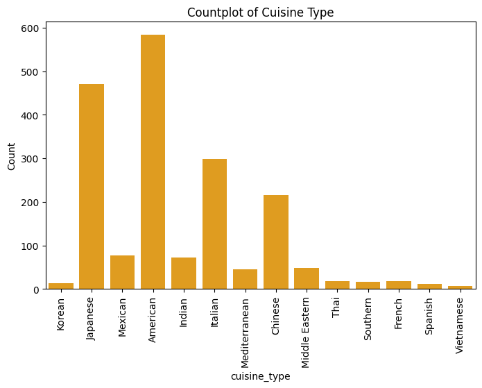
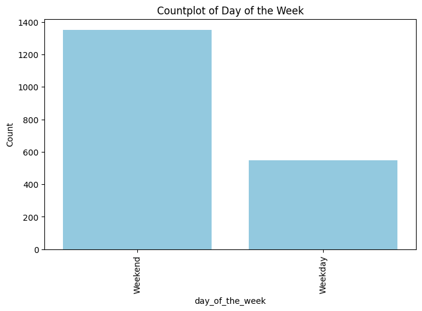
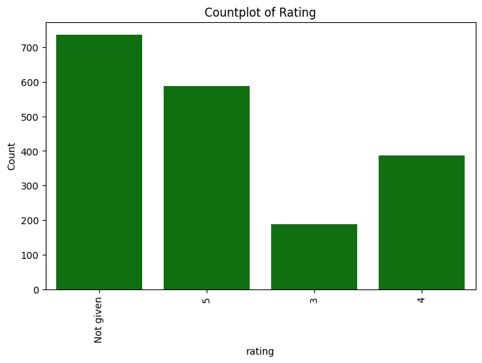

# FoodHub Data Analysis: Insights into Restaurant Performance and Customer Satisfaction

### Project Overview
This project involves analyzing food order data from a fictional food aggregator company, **FoodHub**, which provides delivery services from various restaurants through its smartphone app. The goal is to analyze order data to derive insights that can enhance customer experience and optimize business operations.

### Context
With the growing number of restaurants in New York, FoodHub serves busy professionals and students by offering a seamless online food delivery service. By analyzing stored data, the company aims to:
- Understand customer preferences.
- Improve restaurant partnerships.
- Optimize delivery logistics.

### Objectives
As a data scientist, you are tasked with answering key business questions to help FoodHub enhance its services. These insights will focus on restaurant demand, delivery performance, and customer satisfaction.

### Data Description
The dataset includes various aspects of food orders made through the FoodHub app:
- order_id: Unique identifier for each order.
- customer_id: Unique identifier for the customer.
- restaurant_name: Name of the restaurant.
- cuisine_type: Type of cuisine ordered.
- cost: Total cost of the order.
- day_of_the_week: Day when the order was placed (Weekday/Weekend).
- rating: Customer rating for the order (out of 5).
- food_preparation_time: Time taken by the restaurant to prepare the food (in minutes).
- delivery_time: Time taken by the delivery person to deliver the food (in minutes).

### Tools and Libraries
The following libraries were used in this project:
- Pandas and NumPy for data manipulation.
- Matplotlib and Seaborn for data visualization.
- SciPy for statistical analysis.

### Key Features
- Exploratory Data Analysis (EDA)
- Data Visualization
- Statistical Testing
- Business Recommendations

### Project Structure
- **borja_python_project.html:** The HTML export of the Jupyter notebook for easy viewing.
- **README.md:** This file.
- **images/:** Folder containing key visualizations (e.g., popular_cuisines.png, delivery_times.png).

### Results
Insights from analysis will help FoodHub in:
- Identifying popular cuisines.
- Assessing restaurant performance.
- Improving delivery times.
- Enhancing customer satisfaction through data-driven decisions.

### Sample Visualizations
1. Popular Cuisines  

3. Delivery Times on Weekends vs Weekdays  

5. Customer Ratings Distribution  

### Conclusions

### Recommendations

### How to View
- **HTML Report**: Open [borja_python_project](https://dannycborja.github.io/foodhub-data-analysis/borja_python_project.html) in your browser for a static view of the analysis.
